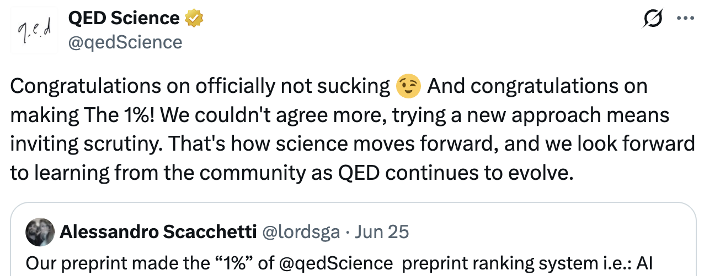

Oded Rechavi, at QED Science, believes that if your paper is not in the top 1% of their QED score then it ["sucks"](https://x.com/qedScience/status/2070119903693078850?s=20). But what is this QED score and what is its purpose? Does it really measure scientific quality? If a paper is not in the 1% does it really suck?

These are important questions because scientists are increasingly overwhelmed with the volume of new work posted on preprint servers and published in journals. Traditional quality signals such as journal, conference venue, and institution are becoming less reliable. AI further compounds this problem by making it easy to produce plausible scientific writing at scale. Papers are longer, figures are denser, and the existence of a paper is no longer sufficient evidence that it represents substantial scientific work.

In light of this, companies like QED Science are attempting to address this problem. QED uses Large Language Models (LLMs) to review scientific papers and provide AI feedback. Many scientists report that the feedback is useful and often resembles comments received during human peer review.

QED recently released a [white paper](https://www.qedscience.com/blog/qed-score-a-validated-ai-based-quality-metric) that goes one step further and describes the "QED Score", a single number that is intended to measure a paper's quality. The QED score is generated by prompting a collection of LLMs to review a paper for "originality" and "validity". The resulting evaluations are combined into a single score. In their white paper, the authors claim that the QED score is a "more accurate, faster, and less biased estimate of paper quality than journal rank." The authors present three validation studies, all of which compare the QED score against the [SCImago Journal Rank (SJR)](https://en.wikipedia.org/wiki/SCImago_Journal_Rank), a journal-level metric based on citation data. The first study compares QED and SJR against expert-assigned labels ("Limited", "Satisfactory", and "Strong"). The second compares QED scores for 2,879 bioRxiv preprints with the SJR of the journals in which those papers were eventually published. The third asks experts to choose between pairs of papers where QED and SJR disagree most strongly.

In this review I evaluate whether the evidence presented supports the claim that the QED score is a more accurate and less biased estimate of paper quality. While QED clearly provides a much faster review than traditional peer review, the evidence presented does not support the authors' claims that the QED score is a more accurate or less biased measure of scientific quality.

## Case study 1 is methodologically opaque and does not effectively demonstrate that the QED score measures paper quality

In case study 1, the authors obtain a curated dataset of 975 published papers labelled "Limited", "Satisfactory", or "Strong" by a panel of expert reviewers whose identities are not disclosed. Each paper received a label based on validity and originality, the same criteria used to generate the QED score. The authors then asked whether the QED score or the SJR better predicted these labels. QED achieved an AUC of 0.863 versus 0.804 for distinguishing Limited from Satisfactory + Strong papers, and 0.782 versus 0.774 for distinguishing Strong from Satisfactory + Limited papers.

These values cannot be meaningfully interpreted without the underlying data and methodology. The paper does not report the distribution of labels, whether the expert reviewers who generated the benchmark labels were blinded to journal, author, or institutional identity, nor do they provide any data or code to reproduce the analysis. The authors also provide no guarantee that these papers were excluded from the training data of the LLMs used to evaluate them. Therefore, case study 1 does not establish that the QED score accurately measures scientific quality.

## Case study 2 provides inconsistent evidence that the QED score measures quality

The second case study compares QED scores for 2,879 bioRxiv preprints with the SJR of the journals where those preprints were eventually published. Across all fields, the authors report a Spearman correlation of 0.63. Within individual fields, however, the correlations ranged from 0.78 (Genetics) to 0.39 (Systems Biology).

The authors describe the overall agreement as "substantial", but explain weaker agreement in some fields by arguing that the SJR is a noisy proxy for quality. This argument is internally inconsistent. If SJR is a reasonable proxy for scientific quality, then the weaker agreement across fields suggests that the QED score is a weak proxy for quality. If SJR is a noisy proxy for scientific quality, then agreement with SJR cannot be used to validate the QED score. Either way, by the authors' own admission, this analysis does not establish the QED score as an accurate measure of quality.

## Case study 3 contains several uncontrolled sources of variation

The third study asks 15 domain experts to compare papers where QED and SJR disagree most strongly. For each paper the authors subtract log(SJR + 1) from the QED score, compute pairwise contradictions, and retain the 100 strongest disagreements. Only 70 of these pairs were reported with "confident" expert judgments; the remaining 30 were discarded. Among the retained pairs, experts preferred the higher QED-scored paper roughly three times as often as the higher SJR paper.

This experiment introduces several uncontrolled sources of variation. First, the QED score is a paper-level metric assigned to a preprint, whereas SJR is a journal-level metric assigned after peer review. Second, comparisons are made between two different papers where expert preference may depend on writing style, topic, or familiarity with the field rather than scientific quality. Finally, the authors do not explain how "confidence" was defined or why 30% of comparisons were excluded. Consequently, case study 3 does not provide sufficient evidence for the superiority of the QED score.

## The QED score exhibits geographical bias

The public release of QED scores reveals substantial geographic bias against African and South American scientists. Although the white paper states that QED scored 57,455 bioRxiv preprints, the publicly accessible website contains 53,938 domain-assigned preprints (571 in the top 1% and 53,367 in the remaining 99%). The discrepancy is not explained.

The QED website assigns papers to geographic regions based on author affiliations. A paper may belong to multiple regions, meaning a single author is sufficient for a paper to be classified as African. Filtering papers by geographical region on the QED website produces a striking result: only three papers in the top 1% are classified as African. Yet none is led primarily by African institutions.

The first paper in the top 1% ([TENM4 is an essential transduction component for touch](https://www.biorxiv.org/content/10.1101/2024.10.10.617546v2)) has 20 authors with primary affiliations in Germany; it is classified as African because one author has a secondary affiliation in Egypt. The second paper ([Memory Regulatory T Cells Reprogram into Protective Tfh-like Effectors in Recurrent Malaria](https://www.biorxiv.org/content/10.1101/2025.10.15.682462v1)) has ten authors, only one of whom has an African affiliation. The third ([Modular and redundant genomic architecture underlies combinatorial mechanism of speciation and adaptive radiation](https://www.biorxiv.org/content/10.1101/2025.07.07.663194v2)) has eleven authors, again with only one African-affiliated author. In other words, the top 1% contains no paper led primarily by African institutions.

In contrast, [Inflammatory Biomarkers of Asymptomatic and Symptomatic Tuberculosis](https://www.biorxiv.org/content/10.1101/2025.10.26.684319v1) addresses a disease that disproportionately affects sub-Saharan Africa and includes 28 authors with primary African affiliations and only six with primary European or North American affiliations. Despite being far more representative of African science, it was ranked in the bottom 99%.

Taking this a step further, the regional classifications exhibit significant biases. Using the regional classifications reported by QED, African classifications (3 vs. 933; p = 0.004) and South American classifications (11 vs. 2,204; p = 0.00055) are significantly underrepresented among papers in the top 1% relative to the remaining 99%.

*Note: Ran Blekhman published [a complementary analysis](https://blekhman.substack.com/p/my-peer-review-of-the-1) demonstrating that the QED top 1% reproduces familiar institutional biases.*

## How do we effectively triage papers?

The rapid growth of scientific publishing is a real problem. AI has lowered the cost of producing convincing scientific writing, making it increasingly difficult to identify work worth reading. My concerns with QED are not with its use of AI, but rather that the evidence presented does not justify the claims about the score for triaging scientific papers. We scientists need better systems for organizing, evaluating, and consuming scientific literature.

I believe AI can be part of that solution. Many researchers, myself included, have found LLMs useful for [indexing scientific papers and providing structured feedback](https://www.biorxiv.org/content/10.64898/2026.01.30.702911v1). But assigning every paper a single number is a much stronger claim than generating useful feedback. Compressing years of scientific work into a single number inevitably discards too much information that scientists care about. Such a score should not be treated as a measure of scientific quality without transparent methodology and rigorous independent validation.

## An important sanity check

As an informal experiment, I submitted the QED white paper to QED itself. The system assigned it a QED score of 46% and identified several methodological concerns. While this is not a formal validation - the system was not designed to evaluate methodological white papers - it is an interesting observation that QED itself identified some, but not all, of the methodological concerns discussed throughout this review. I've included a link to the review report generated by QED here:

[QED review report for the QED Score white paper](qed-score-review-report.pdf)

The QED score remains unvalidated. The white paper's three case studies do not demonstrate that it is a more accurate or less biased measure of scientific quality than existing approaches, and the released rankings exhibit statistically significant geographic bias. Moreover, the authors explicitly acknowledge that "precision of ranking within the top 1% has not been independently validated," despite presenting the top 1% as the central output of the system. By the standards the authors apply to others, this is poor quality science. Should scientists trust a score whose own validation does not meet the standards it claims to enforce?
